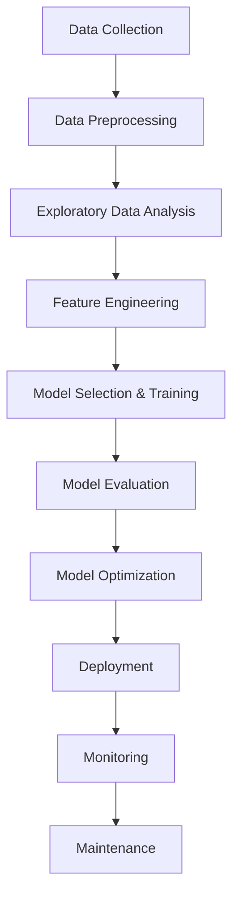

# Predictive Machine Maintenance

## 📌 Overview
Industrial equipment failures cause significant production downtime, costing manufacturers an average of **$50,000-$100,000 per hour**. This project develops a **predictive maintenance system** using machine learning to analyze sensor data and forecast equipment failures before they occur, reducing operational costs.

## 📊 Project Workflow


## 📂 Dataset
- The dataset used is **ai4i2020.csv**, which contains various sensor readings from industrial equipment.
- Features include:
  - **Air temperature [K]**
  - **Process temperature [K]**
  - **Rotational speed [rpm]**
  - **Torque [Nm]**
  - **Tool wear [min]**
  - **Machine failure labels**

## 🛠️ Technologies Used
- **Python**
- **Pandas, NumPy** (Data Manipulation)
- **Matplotlib, Seaborn** (Visualization)
- **Scikit-learn** (Machine Learning)
- **Flask** (Web Application)

## 🔬 Key Steps
1. **Data Collection & Preprocessing**
   - Load and clean the dataset (handling missing values, removing duplicates).
   - Convert data types and define target variables.

2. **Exploratory Data Analysis (EDA)**
   - Visualize sensor data distributions and correlations.
   - Identify patterns in failure occurrences.

3. **Feature Engineering**
   - Standardization and encoding of categorical variables.
   - Selection of relevant features for modeling.

4. **Model Training & Evaluation**
   - Machine learning models trained using Scikit-learn.
   - Performance evaluation using metrics like **accuracy, precision, recall, and F1-score**.

5. **Deployment & Monitoring (Future Scope)**
   - Deploy the trained model for real-time monitoring of machines.
   - Implement an alert system for early warnings.

## 🚀 Running the Project
1. Clone the repository:
   ```bash
   git clone https://github.com/Zhonghong99/predictive_machine_maintenance.git
   ```
2. Install dependencies:
   ```bash
   pip install -r requirements.txt
   ```
3. Run the Jupyter Notebook:
   ```bash
   jupyter notebook Predictive_machine_maintenance.ipynb
   ```
4. Run the application (`app.py`) on your terminal:
   - If using **VS Code**:
     ```bash
     python app.py
     ```
   - If using **PyCharm**:
     - Open `app.py` and click on the **Run** button.
   - If using a standard **terminal**:
     ```bash
     python app.py
     ```

## 📌 Future Improvements
- Integrating deep learning models for better predictions.
- Deploying as a cloud-based API for real-time monitoring.

## 📜 License
This project is licensed under the **MIT License**.  
See the [LICENSE](LICENSE) file for details.
